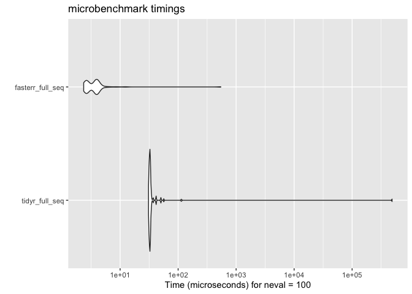
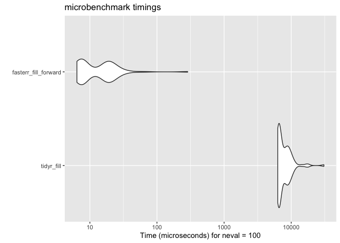

<!-- README.md is generated from README.Rmd. Please edit that file -->

# fasterr 

<!-- badges: start -->

[](https://github.com/sds270-f24/fasterr/actions/workflows/R-CMD-check.yaml)


<!-- badges: end -->

## Summary

This package optimizes three commonly used R functions by rewriting them
in C++ for better performance using `Rcpp`. The C++ implementations are
faster, especially when working with large datasets or vectors, while
keeping the functionality consistent with the original R functions. This
package is designed to make workflows faster without changing the
functionality of functions.

## Installation

The current version of `fasterr` can be installed by:

``` r
remotes::install_github("sds270-f24/fasterr")
```

You can load this package by:

``` r
library(fasterr)
```

## Original Functions

-   [`tidyr::full_seq()`](https://tidyr.tidyverse.org/reference/full_seq.html)
    -   what does this do?
-   [`tidyr::fill()`](https://tidyr.tidyverse.org/reference/fill.html)
    -   This function cleans an inputted `data.frame` by filling `NA`
        values. It takes in a direction as input, with the default being
        “down.” Our `fasterr` version does not take in a direction,
        using the default, meaning `NA` values are filled with the last
        valid non `NA` value as you move down the `data.frame`.
-   [`stats::na.omit()`](https://www.rdocumentation.org/packages/data.table/versions/1.16.2/topics/na.omit.data.table)
    -   This function cleans an inputted `data.frame`, removing rows
        with `NA` values. The function stores information about which
        rows have been removed in an attribute of the cleaned
        `data.frame`.

## Optimized Functions

Example usage and time demonstrations.The times are measured in
microseconds.

### full_seq()

``` r
seq <- c(1, 5, 7, 9, 17)
step <- 2
    
full_seq_results <- microbenchmark::microbenchmark(
    tidyr_full_seq = tidyr::full_seq(seq, step),
    fasterr_full_seq = full_seq(seq, step),
    times = 100
  )

summary(full_seq_results)
#>               expr    min      lq       mean  median      uq        max neval
#> 1   tidyr_full_seq 32.696 35.4750 4907.47355 39.4355 66.0900 484477.553   100
#> 2 fasterr_full_seq  2.918  5.1495   10.03492  6.3360 11.1135     77.856   100
ggplot2::autoplot(full_seq_results)
```



### fill_forward()

``` r
fill_results <- microbenchmark::microbenchmark(
    tidyr_fill = tidyr::fill(airquality, "Ozone", "Solar.R"),
    fasterr_fill_forward = fill_forward(airquality,c("Ozone", "Solar.R")),
    times = 100
  )

summary(fill_results)
#>                   expr      min        lq        mean    median       uq
#> 1           tidyr_fill 6235.070 6710.0680 11914.66448 9649.3180 15646.20
#> 2 fasterr_fill_forward   15.056   16.7985    41.03662   32.7845    39.42
#>         max neval
#> 1 47763.527   100
#> 2   282.237   100
ggplot2::autoplot(fill_results)
```



### omit_na()

``` r
omit_na_results <- microbenchmark::microbenchmark(
    stats_na.omit = stats::na.omit(airquality),
    fasterr_omit_na = omit_na(airquality),
    times = 100
  )

summary(omit_na_results)
#>              expr     min       lq     mean   median       uq     max neval
#> 1   stats_na.omit 137.026 149.7575 153.9529 152.6165 155.3315 237.377   100
#> 2 fasterr_omit_na 105.054 112.2325 117.7229 115.3685 119.8260 204.473   100
ggplot2::autoplot(omit_na_results)
```


## Contributors

-   [Emma Ruckle](https://github.com/emruckle)
-   [Molly Daniel](https://github.com/mollyd13)
