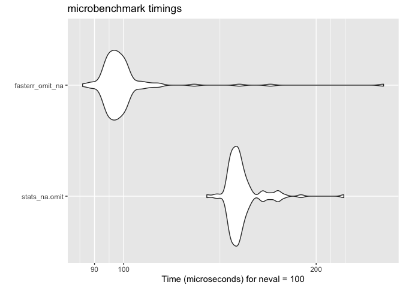

<!-- README.md is generated from README.Rmd. Please edit that file -->

# fasterr 

<!-- badges: start -->

[](https://github.com/sds270-f24/fasterr/actions/workflows/R-CMD-check.yaml)


<!-- badges: end -->

## Summary

This package optimizes three commonly used R functions by rewriting them
in C++ for better performance using `Rcpp`. The C++ implementations are
faster, especially when working with large datasets or vectors, while
keeping the functionality consistent with the original R functions. This
package is designed to make workflows faster without changing the
functionality of functions.

## Installation

The current version of `fasterr` can be installed by:

``` r
remotes::install_github("sds270-f24/fasterr")
```

You can load this package by:

``` r
library(fasterr)
```

## Original Functions

- [`tidyr::full_seq()`](https://tidyr.tidyverse.org/reference/full_seq.html)
  - This function creates the full sequence of values in a vector. It
    takes in a numeric vector, a period, and the numerical tolerance for
    checking periodicity. Our `fasterr` version does not take in
    numerical tolerance, instead not taking into account any tolerance.
- [`tidyr::fill()`](https://tidyr.tidyverse.org/reference/fill.html)
  - This function cleans an inputted `data.frame` by filling `NA`
    values. It takes in a direction as input, with the default being
    “down.” Our `fasterr` version does not take in a direction, using
    the default, meaning `NA` values are filled with the last valid non
    `NA` value as you move down the `data.frame`.
- [`stats::na.omit()`](https://www.rdocumentation.org/packages/data.table/versions/1.16.2/topics/na.omit.data.table)
  - This function cleans an inputted `data.frame`, removing rows with
    `NA` values. The function stores information about which rows have
    been removed in an attribute of the cleaned `data.frame`.

## Optimized Functions

Example usage and time demonstrations.The times are measured in
microseconds.

### full_seq()

``` r
seq <- c(1, 5, 7, 9, 17)
step <- 2
    
full_seq_results <- microbenchmark::microbenchmark(
    tidyr_full_seq = tidyr::full_seq(seq, step),
    fasterr_full_seq = fasterr:::full_seq(seq, step),
    times = 100
  )
#> Warning in microbenchmark::microbenchmark(tidyr_full_seq = tidyr::full_seq(seq,
#> : less accurate nanosecond times to avoid potential integer overflows

summary(full_seq_results)
#>               expr   min      lq       mean median      uq       max neval
#> 1   tidyr_full_seq 14842 15682.5 1567408.27  16113 16748.5 155117473   100
#> 2 fasterr_full_seq   861   984.0    3358.31   1148  1271.0    222015   100
ggplot2::autoplot(full_seq_results)
```


### fill_forward()

``` r
fill_results <- microbenchmark::microbenchmark(
    tidyr_fill = tidyr::fill(airquality, "Ozone", "Solar.R"),
    fasterr_fill_forward = fasterr:::fill_forward(airquality,c("Ozone", "Solar.R")),
    times = 100
  )

summary(fill_results)
#>                   expr      min       lq       mean  median        uq      max
#> 1           tidyr_fill 1668.577 1697.092 1979.76741 1779.40 1932.3505 9542.258
#> 2 fasterr_fill_forward    2.296    2.665    4.31197    3.69    4.4075   29.561
#>   neval
#> 1   100
#> 2   100
ggplot2::autoplot(fill_results)
```


### omit_na()

``` r
omit_na_results <- microbenchmark::microbenchmark(
    stats_na.omit = stats::na.omit(airquality),
    fasterr_omit_na = omit_na(airquality),
    times = 100
  )

summary(omit_na_results)
#>              expr    min      lq     mean  median     uq     max neval
#> 1   stats_na.omit 42.599 43.7265 46.97042 45.2845 46.904  94.669   100
#> 2 fasterr_omit_na 26.568 27.9825 31.06119 28.8230 30.053 106.846   100
ggplot2::autoplot(omit_na_results)
```



## Contributors

- [Emma Ruckle](https://github.com/emruckle)
- [Molly Daniel](https://github.com/mollyd13)
